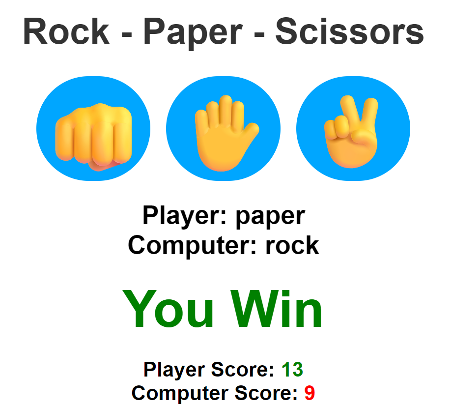

# Rock Paper Scissors Game
A simple Rock-Paper-Scissors game built using **HTML**, **CSS**, and **JavaScript**. This is a browser-based interactive game where a player competes against the computer and scores are tracked dynamically.

---

## Project Description
I created this Rock-Paper-Scissors game to **sharpen my JavaScript fundamentals** and practice working with:
- DOM manipulation
- Event handling
- Conditional logic using `switch` and ternary operators
- Dynamic class styling
- Real-time score updates

This small project gave me an opportunity to turn a classic hand game into an interactive web-based experience, which helped reinforce my frontend development skills.

---

## Project Code
```javascript
const choices = ["rock", "paper", "scissors"];
const playerDisplay = document.getElementById("playerDisplay");
const computerDisplay = document.getElementById("computerDisplay");
const resultsDisplay = document.getElementById("resultsDisplay");
const rockMove = document.getElementById("rockMove");
const paperMove = document.getElementById("paperMove");
const scissorsMove = document.getElementById("scissorsMove");
const playerScoreDisplay = document.getElementById("playerScoreDisplay");
const computerScoreDisplay = document.getElementById("computerScoreDisplay");
let playerScore = 0;
let computerScore = 0;

function playGame(choices, playerChoice){
    let result = "";
    const computerChoice = choices[Math.floor(Math.random() * 3)];

    if(playerChoice === computerChoice){
        result = "Draw"
    }
    else{
        switch(playerChoice){
            case "rock":
                result = (computerChoice === "paper") ? "Computer Wins" : "You Win";
                break;
            case "paper":
                result = (computerChoice === "scissors") ? "Computer Wins" : "You Win";
                break;
            case "scissors":
                result = (computerChoice === "rock") ? "Computer Wins" : "You Win";
                break;
        };
    };
    
    resultsDisplay.classList.remove("greenText", "redText");

    switch(result){
        case "You Win":
            resultsDisplay.classList.add("greenText");
            playerScore++;
            playerScoreDisplay.textContent = playerScore;
            break;
        case "Computer Wins":
            resultsDisplay.classList.add("redText");
            computerScore++;
            computerScoreDisplay.textContent = computerScore;
            break;
    }

    playerDisplay.textContent = `Player: ${playerChoice}`;
    computerDisplay.textContent = `Computer: ${computerChoice}`;
    resultsDisplay.textContent = result;
};

rockMove.addEventListener("click", () => {
    playGame(choices, "rock");
});
paperMove.addEventListener("click", () => {
    playGame(choices,"paper");
});
scissorsMove.addEventListener("click", () => {
    playGame(choices,"scissors");
});
```

---

## How the Game Works
- The user clicks one of the three buttons: ✊ (rock), ✋ (paper), ✌️ (scissors).
- The computer randomly picks one of the three choices.
- A `switch` statement and ternary logic determine the winner of each round.
- Scores are tracked and updated instantly.
- Color feedback is given for wins and losses using `classList` manipulation (`greenText` for win, `redText` for loss).

---

## What I Did
- I used `Math.random()` to generate the computer's move.
- I implemented a `switch` statement combined with ternary operators to determine the game result in a concise way.
- I used `classList.add()` and `classList.remove()` to apply dynamic feedback based on the game's outcome.
- I updated the HTML DOM elements to reflect the player’s and computer’s choices and updated scores.
- I kept the code modular by separating display logic from the main game logic.

---

## What I Learnt
- How to use the `switch` statement and ternary operator to cleanly handle conditional logic.
- How to manipulate the DOM dynamically using `textContent`.
- How to use `classList.add()` and `classList.remove()` to style elements based on game results.
- The importance of keeping UI state in sync with logic.
- Improved understanding of event-driven programming with `addEventListener`.

---

## Technologies Used
- HTML5
- CSS3
- JavaScript (ES6+)

---

## Why I Built This
I took on this challenge as a small but fun way to:
- Practice real-time UI updates
- Gain more confidence with conditionals and events in JavaScript
- Improve how I manage game state and feedback using DOM elements

Even though it's a basic project, it helped me strengthen my foundational JavaScript and DOM skills. Building games like this gives me fast feedback and keeps learning fun.

---

## Screenshot
